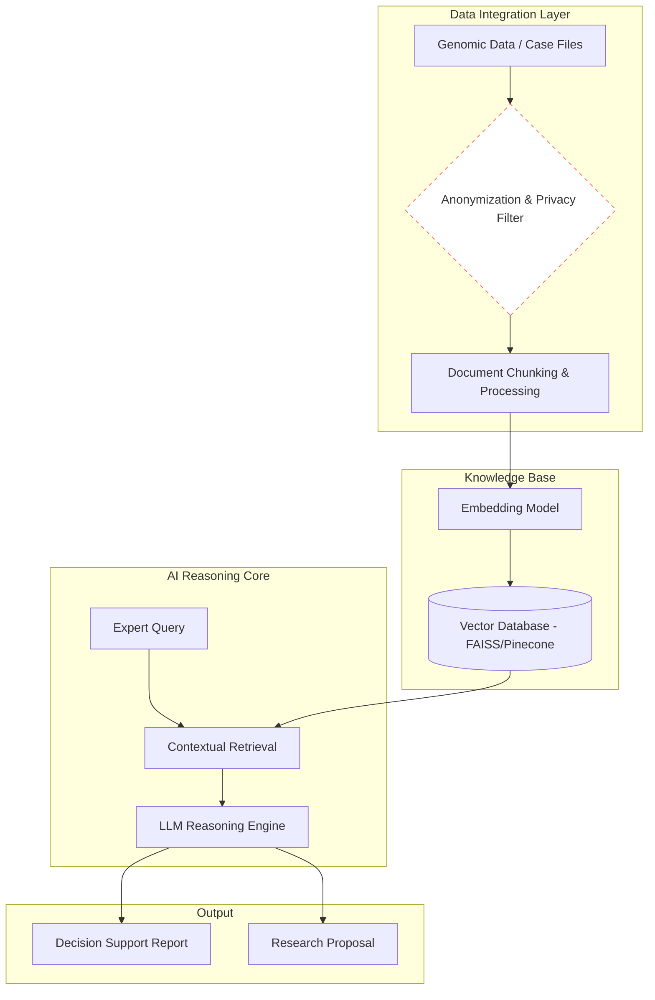

# AI Systems for Genomics, Forensics & HealthTech

Researcher and systems architect working at the intersection of biological data and applied AI infrastructure. My focus is building production-grade RAG and decision-support systems for specialized domains where data sensitivity and precision are critical.

## Projects

### 1. Genetic Testing Decision Support — InsurTech
An AI system for insurance providers to validate high-cost genetic testing orders via automated clinical report analysis. Built on a secure RAG pipeline with domain-specific retrieval over medical literature and insurance guidelines.
**Status:** Live

### 2. Personalized Genetic Patient Navigator
A RAG-based expert system that acts as a virtual genetic consultant — helping patients interpret complex diagnostic results and understand their disease trajectory in plain language.
**Status:** Beta

### 3. Health-Tech Charity & Commission Automation
An ecosystem connecting patients, physicians, and diagnostic labs, with AI-driven tracking for donor credit allocation and commission management.
**Status:** Live

### 4. Research Proposal Generation Engine
A specialized tool for research institutes that synthesizes scientific literature to generate data-driven research proposals and gap analyses.
**Status:** In development

### 5. Forensic Medicine AI Infrastructure
A secure RAG framework for Forensic Medicine Commissions to support case file analysis and legal-medical reporting.
**Status:** MVP delivered, contracts in progress

### 6. Molecular Docking & Systems Biology
Computational pipelines for protein-ligand interaction modeling, including primer design and in silico validation for molecular biology research.

---

## Why Private Repositories?

These projects handle sensitive data — genomic records, insurance claims, forensic case files. Source code is kept private to comply with applicable data protection requirements and client confidentiality agreements.

---

## High-Level Architecture (RAG Framework)

